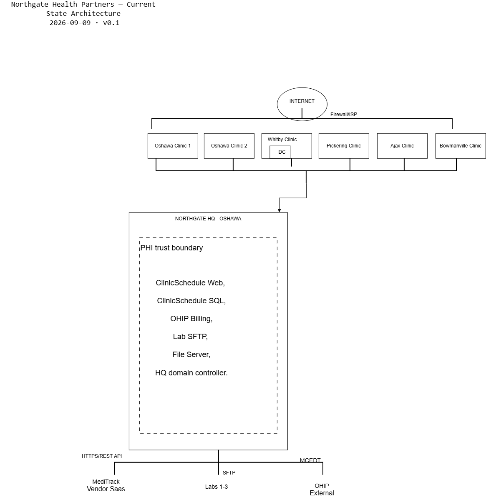

# Northgate Health Partners — Azure Cloud Migration

> A twelve-week enterprise cloud migration and modernization project for a fictional
> six-clinic healthcare group in Durham Region, Ontario. Designed, built, secured,
> monitored, broken and documented end to end.

**Status:** Week 1 of 12 — Foundations and business case
**Last updated:** _(set this every week)_

---

## The scenario

Northgate Health Partners is a Family Health Organization operating six clinics and
one head office across Durham Region, Ontario. It employs ~450 staff, serves ~120,000
rostered patients and handles ~1,400 visits per day.

Its head office lease — including the server room — expires in 14 months and will not
be renewed. Its hardware is out of warranty, its tape backup has never been restore-tested,
five PHIPA privacy findings remain open, its patient scheduling application slows to a
crawl every weekday morning, and an acquisition of a three-clinic group closes in seven months.

I was assigned as Technology Analyst to assess the estate, build the business case, design
the target architecture, migrate the workloads, secure them, monitor them, and prove the
whole thing survives a disaster.

---

## Architecture

<!-- Replace with the current-state diagram in Week 1, target-state from Week 3 onward -->


---

## The business problem

- **The building is going away.** The head office lease expires in 14 months at a 40% renewal increase. Everything in the server room has to move somewhere.
- **The board is frightened of ransomware.** Attacks on five southwestern Ontario hospitals in 2023 and on Newfoundland's health system in 2021 prompted a question IT could not answer: *"If that happened to us on a Monday, when would we see patients again?"*
- **Five PHIPA findings are open.** No documented access authorization, shared admin accounts, no access reviews, no retention schedule, no audit logging on systems holding personal health information.

---

## What has been delivered

| Week | Focus | Key artifacts |
|---|---|---|
| 1 | Foundations, assessment, business case | [Current state assessment](docs/00-current-state-assessment.md) · [Business case](docs/01-business-case.md) · [Naming standard](docs/03-naming-and-tagging-standard.md) · [INC-001](incidents/INC-001-cost-alert/README.md) |
| 2 | Compute migration | _pending_ |
| 3 | Network design | _pending_ |
| 4 | Identity and access | _pending_ |
| 5 | Storage and retention | _pending_ |
| 6 | Database migration | _pending_ |
| 7 | Integration and APIs | _pending_ |
| 8 | Infrastructure as code | _pending_ |
| 9 | Monitoring and operations | _pending_ |
| 10 | Security and governance | _pending_ |
| 11 | Resilience, cost, acquisition | _pending_ |
| 12 | Consolidation and presentation | _pending_ |

---

## Start here

If you are reviewing this repository, these five documents give the clearest picture:

1. **[Business case](docs/01-business-case.md)** — the problem, five options considered, the recommendation and the five-year numbers
2. **[Current state assessment](docs/00-current-state-assessment.md)** — what existed, what it cost, and the risk register
3. **[Architecture decision records](adr/)** — every significant decision, with the options rejected and the consequences accepted
4. **[Incidents](incidents/)** — real troubleshooting, with timelines and root cause analysis
5. **[Solution architecture](docs/02-solution-architecture.md)** — the complete target design _(from Week 12)_

---

## Repository map

```
docs/            Design documents, assessments, policies, plans
adr/             Architecture decision records — one per significant decision
incidents/       Incident write-ups with timeline, root cause and actions
infrastructure/  Bicep templates and modules (from Week 8)
scripts/         Azure CLI, PowerShell, KQL and SQL
runbooks/        Operational procedures written for someone else to follow
diagrams/        Architecture, network, data flow and sequence diagrams
presentations/   Stakeholder decks and recordings
learning-notes/  Working notes and weekly retrospectives
```

---

## Technologies

**Cloud:** Microsoft Azure (Canada Central primary, Canada East paired)
**Compute:** Virtual Machines, Virtual Machine Scale Sets, App Service
**Networking:** Virtual Network, NSGs, hub-and-spoke, Private Endpoints, VPN Gateway
**Identity:** Microsoft Entra ID, RBAC, Conditional Access, Managed Identities
**Data:** Azure SQL Database, Azure Storage, Azure Files
**Integration:** Logic Apps, Azure Functions, Service Bus, Event Grid
**Operations:** Azure Monitor, Log Analytics, KQL, Azure Backup, Site Recovery
**Governance:** Azure Policy, Defender for Cloud, Key Vault, Microsoft Purview
**Tooling:** Bicep, Azure CLI, PowerShell, Git, GitHub Actions, draw.io

---

## Cost discipline

This environment was built and operated on an Azure free account. Every expensive
component was deployed deliberately, documented, evidenced and destroyed the same day.
From Week 8 the entire environment is defined in Bicep and is torn down and rebuilt on
demand, which is both a cost control and a genuine disaster recovery capability.

<!-- Insert your budget configuration screenshot here in Week 1 -->


---

## A note on the scenario

Northgate Health Partners, Riverside Family Care, MediTrack and ClinicSchedule are
fictional. The business drivers, technical constraints, regulatory obligations and
failure modes are modelled on real Ontario healthcare IT environments, and the
security incidents referenced in the business case (TransForm SSO 2023, Newfoundland
and Labrador 2021, LifeLabs 2019) are real and publicly reported.
